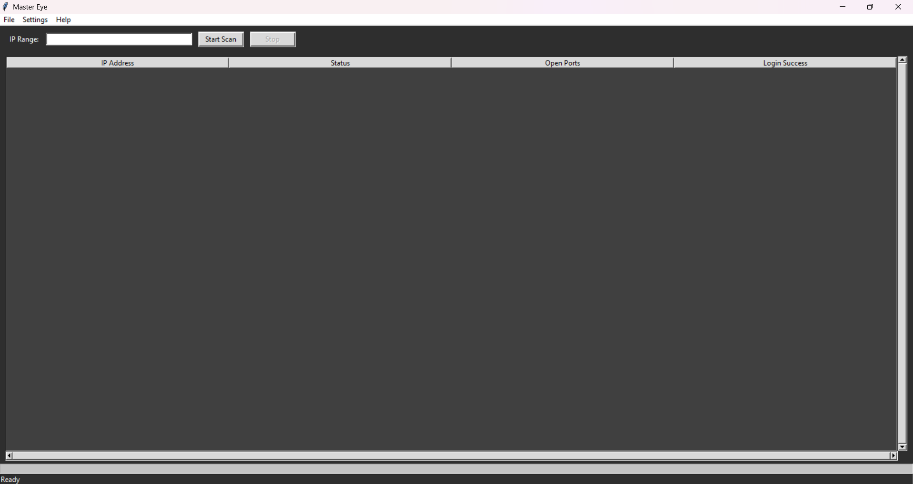

# MasterEye - IP Scanner

  
*A powerful multi-threaded IP scanner with port scanning, credential testing, and a user-friendly GUI.*

## Features
- Scan an IP range for active hosts
- Check for open ports (default: 80, 443, 8080)
- Attempt login with default credentials
- Multi-threaded scanning for speed
- Export results in CSV & JSON formats
- Dark theme support

## Installation
### Prerequisites
Ensure you have Python 3 installed. You can check by running:
```sh
python --version
